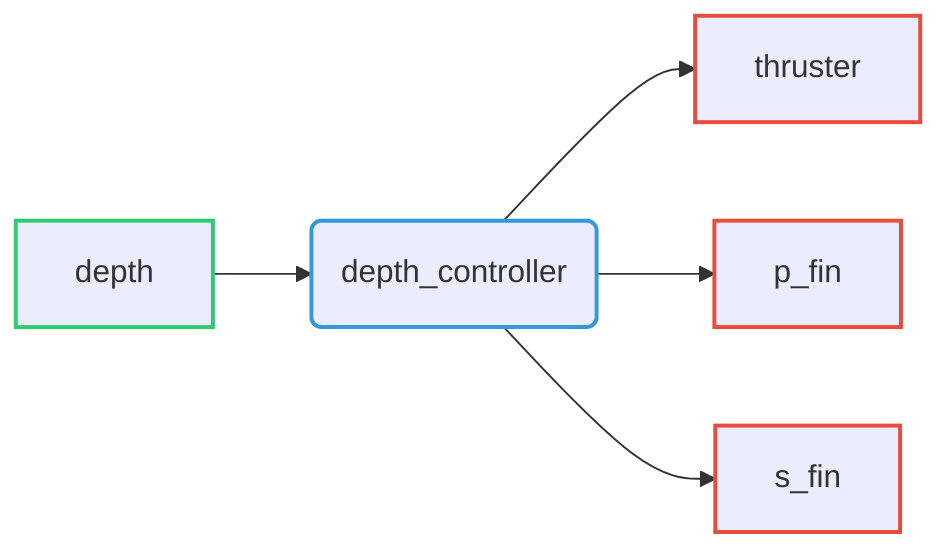

# Depth controller

Depth controller able to control depth of the Riptide by controlling the robot's pitch.

## Command interfaces

| `command_interface` | Description         |
| ------------------- | ------------------- |
| `thruster`          | Thruster velocity   |
| `p_fin`             | Port-fin angle      |
| `s_fin`             | Starboard-fin angle |

## State interfaces

| `state_interface` | Description   |
| ----------------- | ------------- |
| `depth`           | Riptide depth |

## Parameters
-