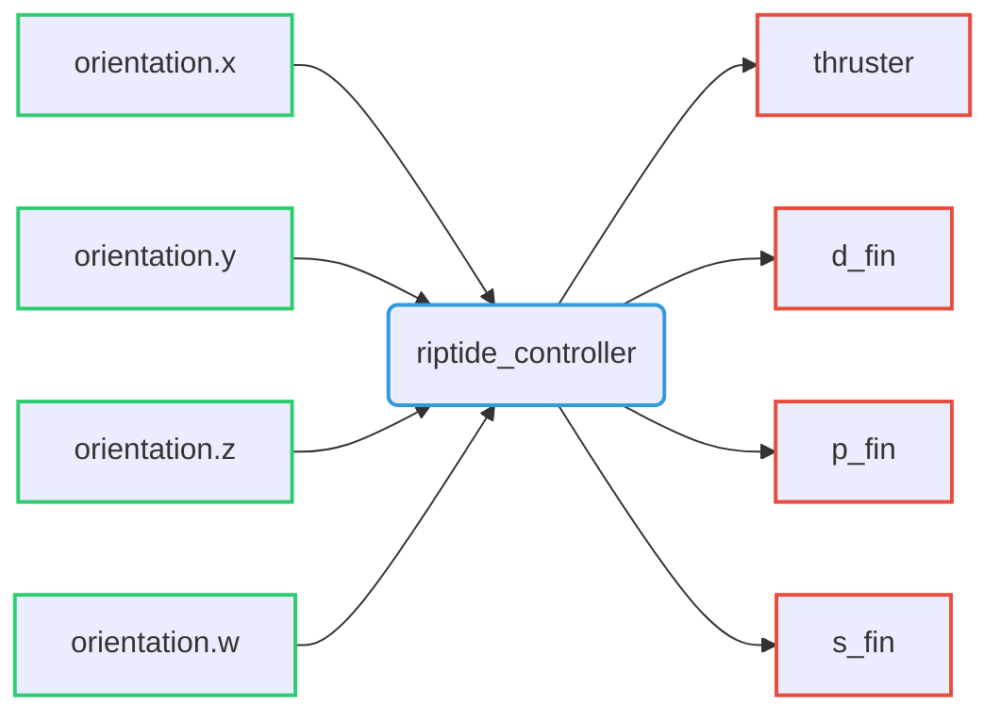

# Riptide Controller

Riptide controller able to generate thruster and fin control values from desired linear and angular velocities.

## Command interfaces

| `command_interface` | Description         |
| ------------------- | ------------------- |
| `thruster`          | Thruster velocity   |
| `p_fin`             | Direction-fin angle |
| `p_fin`             | Port-fin angle      |
| `s_fin`             | Starboard-fin angle |

## State interfaces

| `state_interface` | Description                    |
| ----------------- | ------------------------------ |
| `orientation.x`   | Robot orientation quaternion x |
| `orientation.y`   | Robot orientation quaternion y |
| `orientation.z`   | Robot orientation quaternion z |
| `orientation.w`   | Robot orientation quaternion w |

## Parameters

- 

## Actions server

action can be called 

