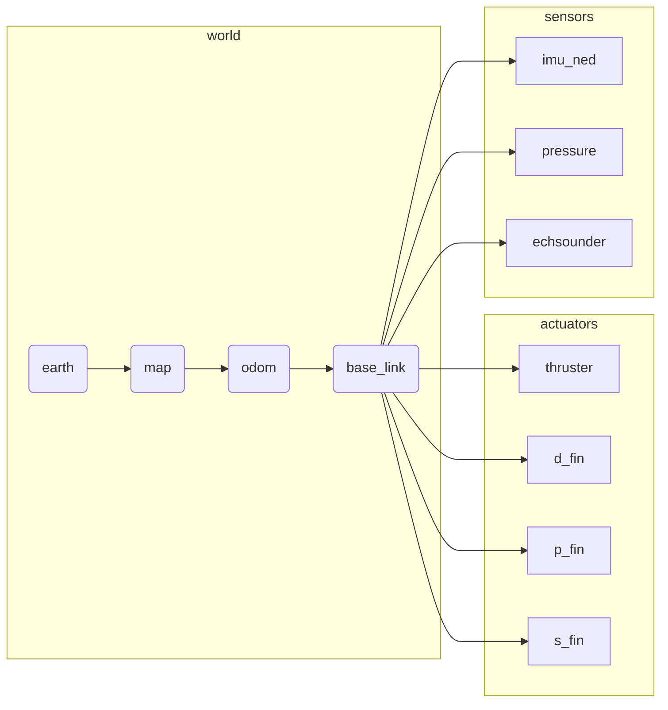

# Transforms

## Riptide Transforms

TF is the Riptide are following the [REP-105: Coordinate Frames for Mobile Platforms](https://www.ros.org/reps/rep-0105.html).

```mermaid
flowchart LR
    subgraph world
    direction LR
    w1(earth)-->w2(map)-->w3(odom)-->w4(base_link)
    end
    subgraph actuators
    direction LR
    w4-->thruster & d_fin & p_fin & s_fin
    end
    subgraph sensors
    direction LR
    w4--> imu_ned & pressure & echsounder
    end
```
