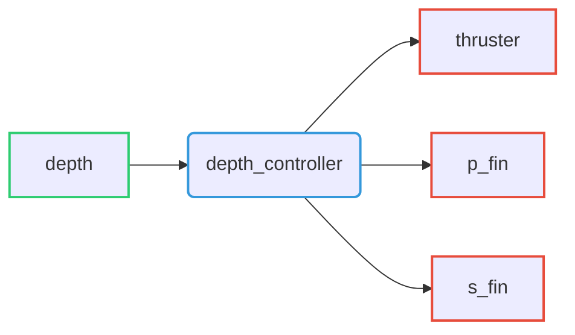
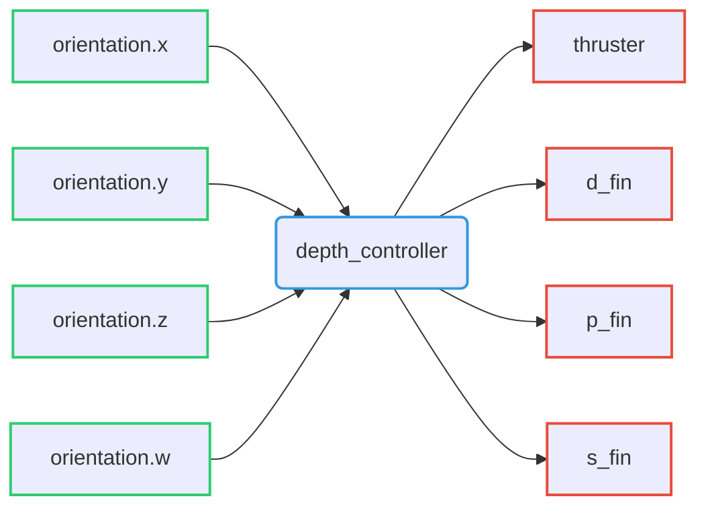

# Available controllers

Here is the list of implemented controllers for the Riptide

| Controller name          | Type                  | Description                         |
| ------------------------ | --------------------- |------------------------------------ |
| `depth_controller`       | `Controller`          | Simple depth controller             |
| `riptide_controller`     | `ChainableController` | Riptide twist controller            |
| `log_controller`         | `Controller`          | Log based atitude controller        |
| `orthogonal_controller`  | `Controller`          | Orhtogonal based atitude controller |
| `immersion_controller`   | `Controller`          | Riptide immersion controller        |

??? Example "Implementation of `orthogonal_controller`"
    `orthogonal_controller` implementation is still in progress!

??? Example "Implementation of `immersion_controller`"
    `immersion_controller` implementation is not yet implemented!

??? Failure "Chaining controllers"
    Controller chaining is not yet implemented for these controllers!

## Depth controller

Depth controller able to control depth of the Riptide by controlling the robot's pitch.

### Command interfaces

| `command_interface` | Description         |
| ------------------- | ------------------- |
| `thruster`          | Thruster velocity   |
| `p_fin`             | Port-fin angle      |
| `s_fin`             | Starboard-fin angle |

### State interfaces

| `state_interface` | Description   |
| ----------------- | ------------- |
| `depth`           | Riptide depth |

### Parameters

-

## Riptide Controller

Riptide controller able to generate thruster and fin control values from desired linear and angular velocities.

### Command interfaces

| `command_interface` | Description         |
| ------------------- | ------------------- |
| `thruster`          | Thruster velocity   |
| `p_fin`             | Direction-fin angle |
| `p_fin`             | Port-fin angle      |
| `s_fin`             | Starboard-fin angle |

### State interfaces

| `state_interface` | Description                    |
| ----------------- | ------------------------------ |
| `orientation.x`   | Robot orientation quaternion x |
| `orientation.y`   | Robot orientation quaternion y |
| `orientation.z`   | Robot orientation quaternion z |
| `orientation.w`   | Robot orientation quaternion w |

### Parameters

- 

### Actions server

action can be called 

