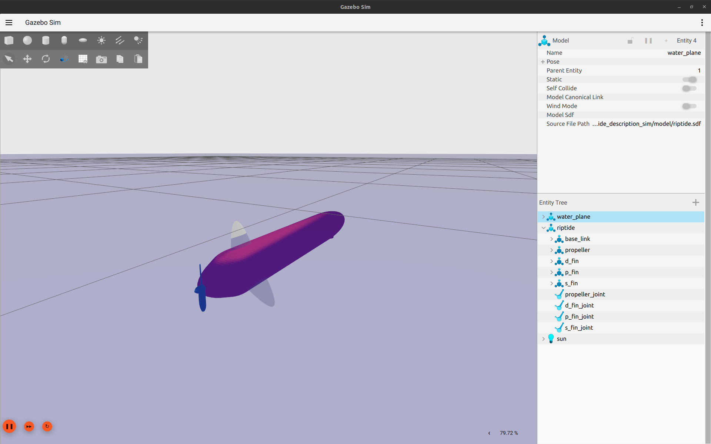

# Simulator

The simulator is based on [Ignition Gazebo Garden](https://gazebosim.org/home). It let to quickly test the behavior of the Riptide while implementing new control laws.

## Available worlds

The riptide is currently launched in an infinite ocean. The sea-surface is fixed at $z = 0\ m$, above the fluid density is fixed at $\rho_{air} = 1\ kg.m^{-3}$ and below this limit the density is fixed at $\rho_{air} = 1000\ kg.m^{-3}$.

??? Warning "Actuators and sea surface"
    Actuators are for now configured to generate forces and momentums with a constant fluid density (i.e. the graded fluid density is not taken into account for force generation).
    
    It means that actuators are able to move the Riptide in air as well as in water, except that in air the buoyancy is well computed so the robot need more forces and momentums to be moved.