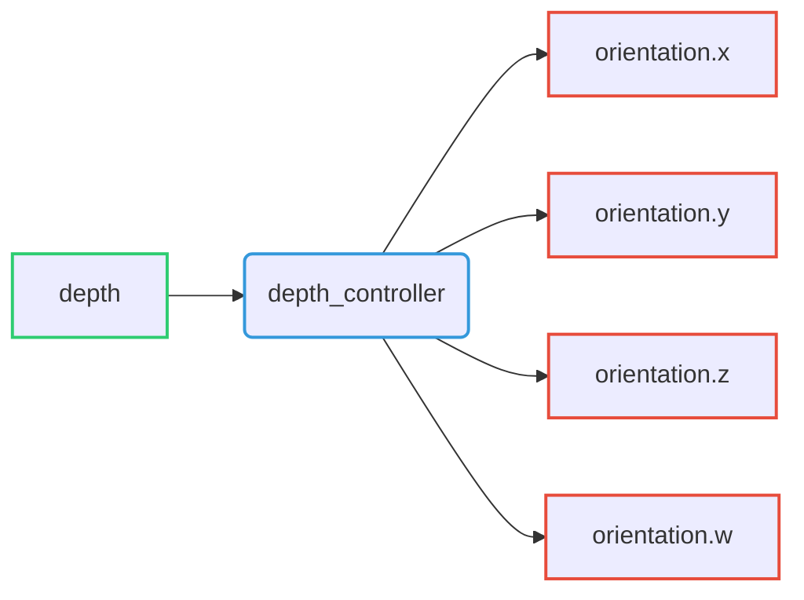

# Depth controller

Depth controller able to control depth of the Riptide by controlling the robot's pitch.

## Command interfaces

| `command_interface` | Description                      |
|---------------------|----------------------------------|
| `quaternion.x`      | Desired orientation quaternion x |
| `quaternion.y`      | Desired orientation quaternion y |
| `quaternion.z`      | Desired orientation quaternion z |
| `quaternion.w`      | Desired orientation quaternion w |

## State interfaces

| `state_interface` | Description   |
| ----------------- | ------------- |
| `depth`           | Riptide depth |

## Published topics

| Topic name            | Type                                  | Description             |
|-----------------------|---------------------------------------|-------------------------|
| `~/controller_state`  | `riptide_msgs/RiptideControllerState` | Controller actual state |

## Provided action

| Action name | Type                 | Description              |
|-------------|----------------------|--------------------------|
| `~/depth`   | `riptide_msgs/Depth` | Controller desired depth |