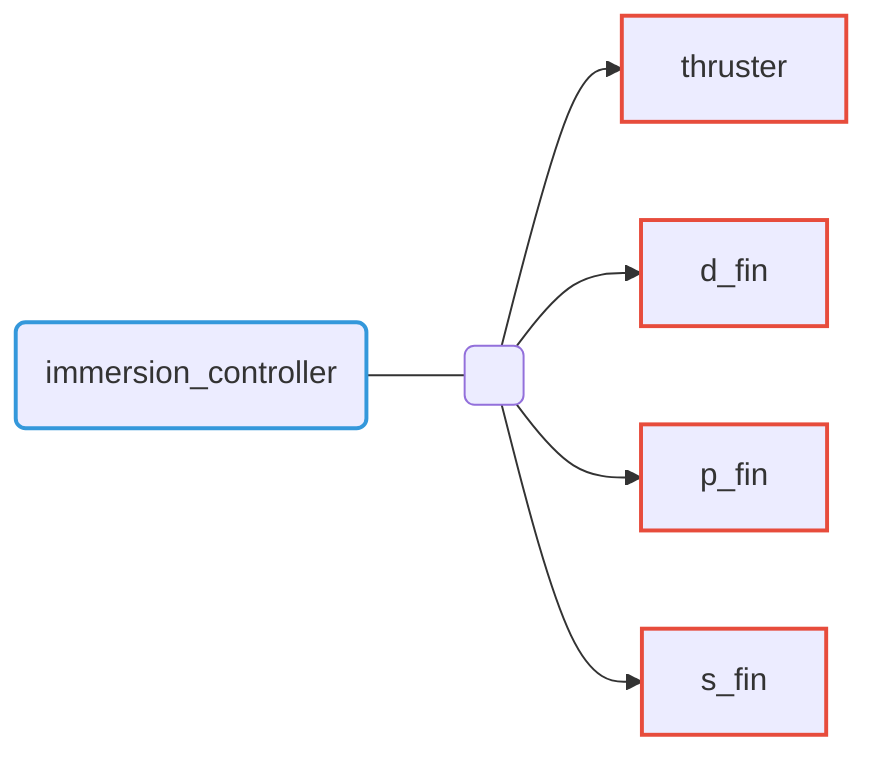

# Immersion controller

Open loop immersion controller able to immerse the Riptide 1m below the sea surface. The strategy is to set the thruster's velocity at its maximum, and to perform a maneuver on the fins such as the Riptide's pitch increase and then decrease suddenly.

## Command Interfaces

| `command_interface` | Description         |
| ------------------- | ------------------- |
| `thruster`          | Thruster velocity   |
| `p_fin`             | Direction-fin angle |
| `p_fin`             | Port-fin angle      |
| `s_fin`             | Starboard-fin angle |

## Provided action

| Action name | Type                   | Description              |
|-------------|------------------------|--------------------------|
| `~/immerse` | `riptide_msgs/Immerse` | Controller immerse order |