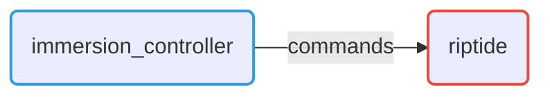
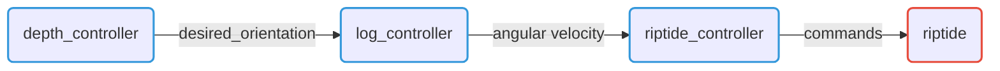

# Ros2Control controllers

## List of controllers

Here is the list of implemented controllers for the Riptide

| Controller name                                               | Type                  | Description                               |
|---------------------------------------------------------------|-----------------------|-------------------------------------------|
| [`immersion_controller`](./immersion_controller.md)           | `Controller`          | Riptide immersion controller              |
| [`riptide_controller`](./riptide_controller.md)               | `ChainableController` | Riptide twist controller                  |
| [`log_controller`](./log_controller.md)                       | `ChainableController` | Log based atitude controller              |
| [`depth_controller`](./depth_controller.md)                   | `Controller`          | Simple depth controller                   |
| {--[`orthogonal_controller`](./orthogonal_controller.md)--}   | {--`Controller`--}    | {--Orthogonal based atitude controller--} |
| {--[`repartition_controller`](./repartition_controller.md)--} | {--`Controller`--}    | {--Wrench repartition controller--} |

## Typical use

Here is the typical use of chained controllers.

