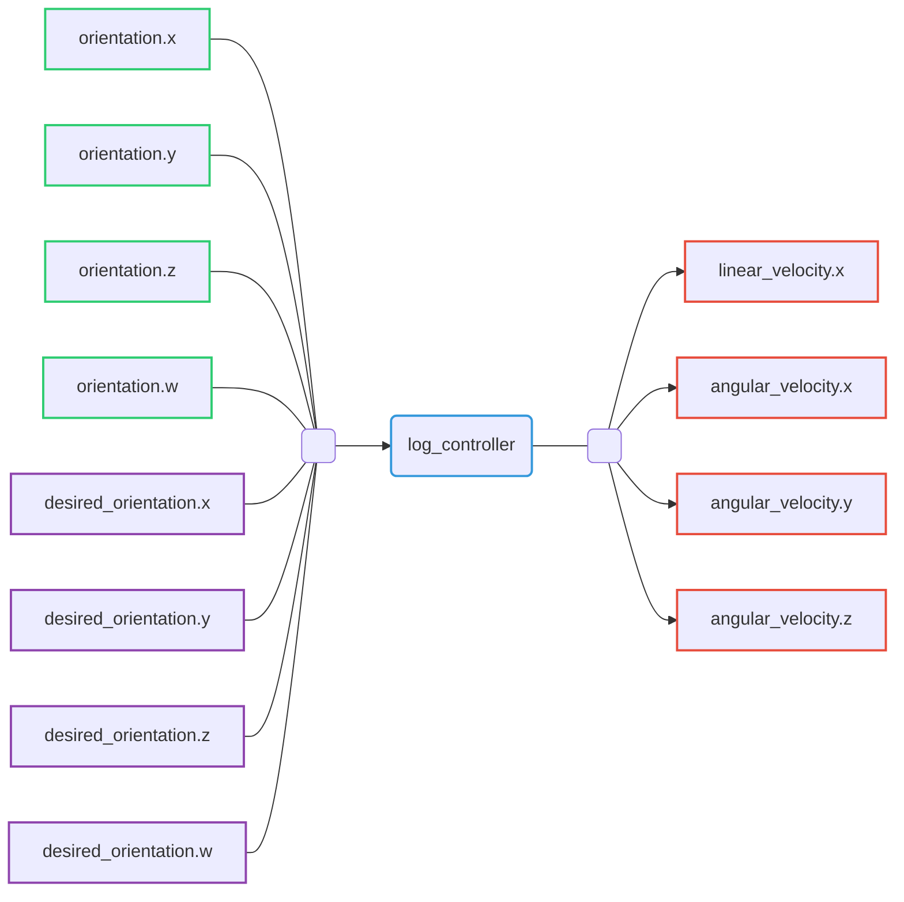

# Log Controller

Log controller able to generate angular velocity from current robot's orientation and desired orientation.

## Command interfaces

| `command_interface`  | Description                             |
|----------------------|-----------------------------------------|
| `linear_velocity.x`  | Requested linear velocity along x axis  |
| `angular_velocity.x` | Requested angular velocity along x axis |
| `angular_velocity.y` | Requested angular velocity along y axis |
| `angular_velocity.z` | Requested angular velocity along z axis |

## State interfaces

| `state_interface` | Description                    |
| ----------------- | ------------------------------ |
| `orientation.x`   | Robot orientation quaternion x |
| `orientation.y`   | Robot orientation quaternion y |
| `orientation.z`   | Robot orientation quaternion z |
| `orientation.w`   | Robot orientation quaternion w |

## Reference interfaces

| `reference_interface`   | Description                      |
|-------------------------|----------------------------------|
| `desired_orientation.x` | Desired orientation quaternion x |
| `desired_orientation.y` | Desired orientation quaternion y |
| `desired_orientation.z` | Desired orientation quaternion z |
| `desired_orientation.w` | Desired orientation quaternion w |

## Subscribed topic

| Topic name             | Type                                                                                                   | Description                    |
|------------------------|--------------------------------------------------------------------------------------------------------|--------------------------------|
| `~/desired_quaternion` | [`geometry_msgs/Quaternion`](http://docs.ros.org/en/noetic/api/geometry_msgs/html/msg/Quaternion.html) | Desired orientation quaternion |

## Published topics

| Topic name            | Type                              | Description             |
|-----------------------|-----------------------------------|-------------------------|
| `~/controller_state`  | `riptide_msgs/LogControllerState` | Controller actual state |
