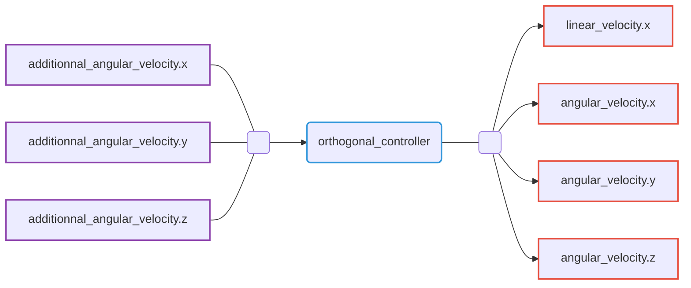

# Orthogonal controller

Orthogonal controller able to control the Riptide in such a way that it makes vectors expressed in the robot frame orthogonal to vectors in the world frame.

This controller is related to the [log_controller](./log_controller.md) in the way that it generate angular velocity for the Riptide, but, unlike the latter, it allows you to control only part of the robot's orientation. This lead to fastest reorientations, and the possibility to control uncontrolled degrees of freedom using other controllers.

## Command Interfaces

| `command_interface`  | Description                             |
|----------------------|-----------------------------------------|
| `linear_velocity.x`  | Requested linear velocity along x axis  |
| `angular_velocity.x` | Requested angular velocity along x axis |
| `angular_velocity.y` | Requested angular velocity along y axis |
| `angular_velocity.z` | Requested angular velocity along z axis |

## State Interfaces

-

## Reference Interfaces

| `reference_interface`           | Description                               |
|---------------------------------|-------------------------------------------|
| `additional_angular_velocity.x` | Additionnal angular velocity along x axis |
| `additional_angular_velocity.y` | Additionnal angular velocity along y axis |
| `additional_angular_velocity.z` | Additionnal angular velocity along z axis |