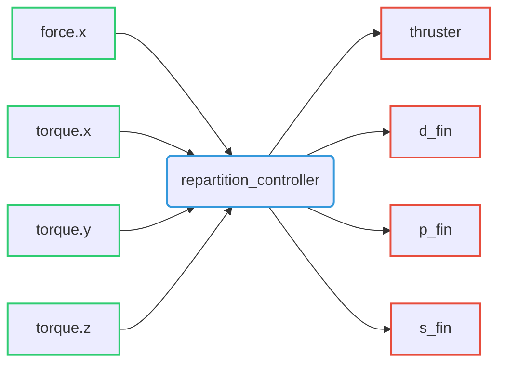

# Repartition Controller

Riptide forces and torques repartition controller able to generate thruster and fin control values from desired Wrench.

## Command interfaces

| `command_interface` | Description         |
|---------------------|---------------------|
| `thruster`          | Thruster velocity   |
| `d_fin`             | Direction-fin angle |
| `p_fin`             | Port-fin angle      |
| `s_fin`             | Starboard-fin angle |

## State interfaces

| `state_interface` | Description                    |
|-------------------|--------------------------------|
| `force.x`         | Robot force quaternion x |
| `torque.x`        | Robot torque y |
| `torque.y`        | Robot torque z |
| `torque.z`        | Robot torque w |

## Reference interfaces

| `reference_interface` | Description                   |
|-----------------------|-------------------------------|
| `force.x`             | Requested force along x axis  |
| `torque.x`            | Requested torque along x axis |
| `torque.y`            | Requested torque along y axis |
| `torque.z`            | Requested torque along z axis |

## Subscribed topics

| Topic name | Type                                                                                           | Description      |
|------------|------------------------------------------------------------------------------------------------|------------------|
| `~/wrench` | [`geometry_msgs/Wrench`](http://docs.ros.org/en/noetic/api/geometry_msgs/html/msg/Wrench.html) | Requested Wrench |

## Published topics

| Topic name            | Type                                      | Description             |
|-----------------------|-------------------------------------------|-------------------------|
| `~/controller_state`  | `riptide_msgs/RepartitionControllerState` | Controller actual state |
