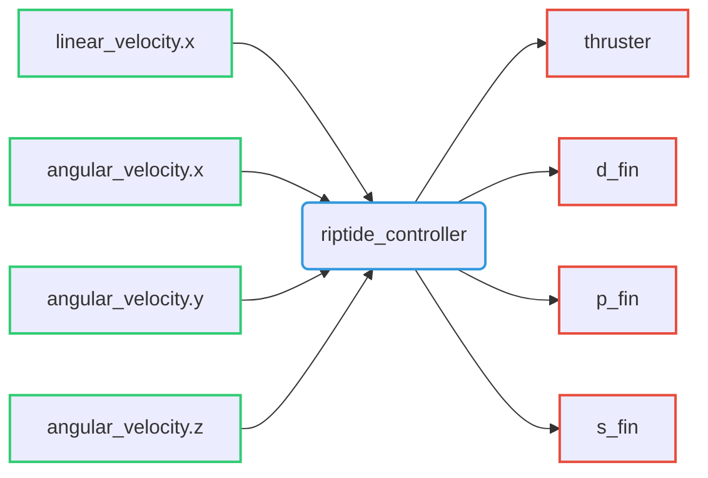

# Riptide Controller

Riptide controller able to generate thruster and fin control values from desired linear and angular velocities.

## Command interfaces

| `command_interface` | Description         |
| ------------------- | ------------------- |
| `thruster`          | Thruster velocity   |
| `p_fin`             | Direction-fin angle |
| `p_fin`             | Port-fin angle      |
| `s_fin`             | Starboard-fin angle |

## State interfaces

| `state_interface` | Description                    |
| ----------------- | ------------------------------ |
| `orientation.x`   | Robot orientation quaternion x |
| `orientation.y`   | Robot orientation quaternion y |
| `orientation.z`   | Robot orientation quaternion z |
| `orientation.w`   | Robot orientation quaternion w |

## Reference interfaces

| `reference_interface` | Description                             |
|-----------------------|-----------------------------------------|
| `linear_velocity.x`   | Requested linear velocity along x axis  |
| `angular_velocity.x`  | Requested angular velocity along x axis |
| `angular_velocity.y`  | Requested angular velocity along y axis |
| `angular_velocity.z`  | Requested angular velocity along z axis |

## Subscribed topic

| Topic name  | Type                                                                                         | Description   |
|-------------|----------------------------------------------------------------------------------------------|---------------|
| `~/cmd_vel` | [`geometry_msgs/Twist`](http://docs.ros.org/en/noetic/api/geometry_msgs/html/msg/Twist.html) | Desired Twist |

## Published topics

| Topic name            | Type                                  | Description             |
|-----------------------|---------------------------------------|-------------------------|
| `~/controller_state`  | `riptide_msgs/RiptideControllerState` | Controller actual state |
